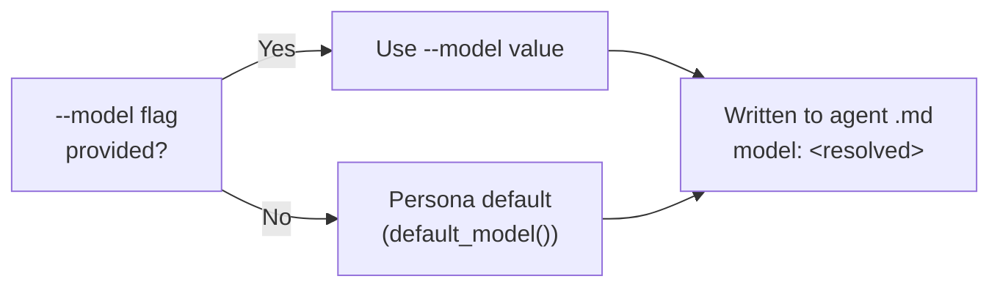

# architecture_prompts

A Rust CLI that activates a specialist architect persona for an [opencode](https://opencode.ai) session. Select one of four embedded system prompts, and the tool writes a project-local opencode agent file and launches opencode with that agent active — all in a single command.

---

## How it works

```
architecture_prompts <ARCHITECT> [OPTIONS]
```

1. You pick an architect persona (`principal`, `design`, `complexity`, or `security`).
2. The tool writes `.opencode/agents/arch-<name>.md` in your current project directory, embedding the system prompt and permission frontmatter.
3. It then execs `opencode --agent arch-<name>`, replacing itself with opencode so the terminal session is handed over cleanly.

---

## Prerequisites

- `opencode` must be installed and available on your `PATH`. It is managed outside Nix.
- Linux (`x86_64` or `aarch64`).

---

## Installation

### From this flake (recommended)

Add to your flake inputs:

```nix
inputs.architecture-prompts.url = "github:youruser/architecture_prompts";
```

**As a system package via overlay:**

```nix
nixpkgs.overlays = [ inputs.architecture-prompts.overlays.default ];
environment.systemPackages = [ pkgs.architecture-prompts ];
```

**Direct package reference:**

```nix
environment.systemPackages = [
  inputs.architecture-prompts.packages.${system}.default
];
```

**Run without installing:**

```bash
nix run github:youruser/architecture_prompts -- principal
```

### Build locally

```bash
nix build .
./result/bin/architecture_prompts --list
```

### Development shell

```bash
nix develop .
cargo build
```

---

## Command-line reference

```
architecture_prompts <ARCHITECT> [OPTIONS]

ARGUMENTS:
  <ARCHITECT>    Architect persona to activate
                 One of: principal, design, complexity, security

OPTIONS:
  -m, --model <PROVIDER/MODEL>
               Override the default LLM model for this persona
               (e.g., github-copilot/claude-opus-4.6).
               If omitted, each persona uses its built-in default.
      --full   Launch opencode with full permissions (conflicts with --review)
      --review Run in review mode: read-only + can write findings to reviews/
               (conflicts with --full)
      --list   List all available architect prompts with descriptions, then exit
      --dry-run
               Print the generated agent .md to stdout; do not write files or launch opencode
  -h, --help   Print help
```

---

## The four architect personas

| Persona | Default model | When to use |
|---|---|---|
| `principal` | `claude-opus-4.6` | Broad system-level review — scalability, reliability, trade-offs, failure modes |
| `design` | `claude-opus-4.6` | Formal gate review — renders an Accept / Accept with concerns / Reject verdict |
| `complexity` | `claude-sonnet-4.6` | Complexity audit — identifies accidental complexity and unjustified component count |
| `security` | `claude-sonnet-4.6` | Trust boundary review — AuthN/AuthZ, blast radius, failure impact on C-I-A |

See [docs/prompts.md](docs/prompts.md) for the full prompt text and detailed guidance on each persona.

---

## Usage examples

### List available personas

```bash
architecture_prompts --list
```

```
Available architect prompts:

  principal     Evaluates architecture at system level: scalability, reliability, trade-offs, failure modes
  design        Architecture review board: renders Accept / Accept with concerns / Reject verdict
  complexity    Simplicity-biased audit: identifies accidental complexity and unjustified component count
  security      Reviews trust boundaries, blast radius, AuthN/AuthZ, and failure impact on C-I-A
```

### Start a read-only principal review

```bash
cd /path/to/your/project
architecture_prompts principal
```

opencode launches with the principal architect persona active. File edits are denied; only read-only git commands (`git log`, `git diff`, `git status`) are permitted.

### Run the design review board with full access

```bash
architecture_prompts design --full
```

All file edits, bash commands, and web fetches are allowed.

### Inspect the generated agent file without launching

```bash
architecture_prompts complexity --dry-run
```

Prints the `.md` file that would be written to `.opencode/agents/arch-complexity.md`, including the YAML frontmatter and the embedded system prompt. Nothing is written to disk.

### Override the default model

```bash
architecture_prompts principal --model openai/gpt-5
```

Overrides the persona's built-in default model for this invocation. The model string is written verbatim to the `model:` field in the agent frontmatter and interpreted by opencode at session start.

### Run a review with saved findings

```bash
architecture_prompts principal --review
```

Launches the principal architect in review mode. The persona can read all repo contents but can only write to `reviews/arch-principal-YYYY-MM-DD.md`. The `reviews/` directory is created automatically before opencode starts. A review-output instruction is appended to the persona's system prompt directing it to save its findings there.

### Suggested review pipeline

Run the personas in sequence for a thorough architecture review:

```bash
# 1. Broad system-level assessment
architecture_prompts principal

# 2. Complexity audit
architecture_prompts complexity

# 3. Security trust-boundary review
architecture_prompts security

# 4. Formal verdict
architecture_prompts design
```

---

## Generated agent file

Each invocation writes a file like this to `.opencode/agents/`:

```
.opencode/
└── agents/
    └── arch-principal.md   ← generated by architecture_prompts
```

When `--review` is used, the tool also creates a `reviews/` directory in the project root for the persona's findings:

```
reviews/
└── arch-principal-2026-04-23.md   ← written by the persona during the session
```

The agent file is overwritten on every invocation, so it always reflects the current embedded prompt. Add the pattern to your `.gitignore` to avoid committing auto-generated files:

```gitignore
.opencode/agents/arch-*.md
```

This project's own `.gitignore` already includes this entry.

---

## Permission modes

| Mode | edit | write | bash | webfetch |
|---|---|---|---|---|
| **Read-only** (default) | deny | deny | `git log*`, `git diff*`, `git status` only | ask |
| **Review** (`--review`) | deny except `reviews/arch-*.md` | deny except `reviews/arch-*.md` | `git log*`, `git diff*`, `git status` only | ask |
| **Full** (`--full`) | allow | allow | all | allow |

---

## Model defaults

Each persona ships with a built-in default LLM model chosen for its scope:

| Persona | Default model | Rationale |
|---|---|---|
| `principal` | `github-copilot/claude-opus-4.6` | Broad system review needs maximum reasoning depth |
| `design` | `github-copilot/claude-opus-4.6` | Formal verdict needs strong judgment |
| `complexity` | `github-copilot/claude-sonnet-4.6` | Focused audit — Sonnet is fast and sufficient |
| `security` | `github-copilot/claude-sonnet-4.6` | Focused audit — Sonnet is fast and sufficient |

The `--model` / `-m` flag overrides the default for a single invocation:

```bash
architecture_prompts principal --model github-copilot/claude-sonnet-4.6
```

The model string is written verbatim to the `model:` field in the agent frontmatter. No validation is performed by this tool — opencode validates the model at session start.



---

## Further reading

- [docs/prompts.md](docs/prompts.md) — detailed description of each architect persona and the suggested review pipeline
- [docs/architecture.md](docs/architecture.md) — internal architecture of this tool
