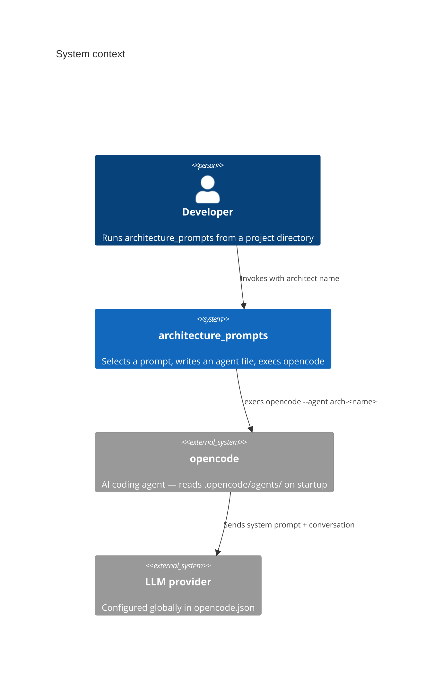
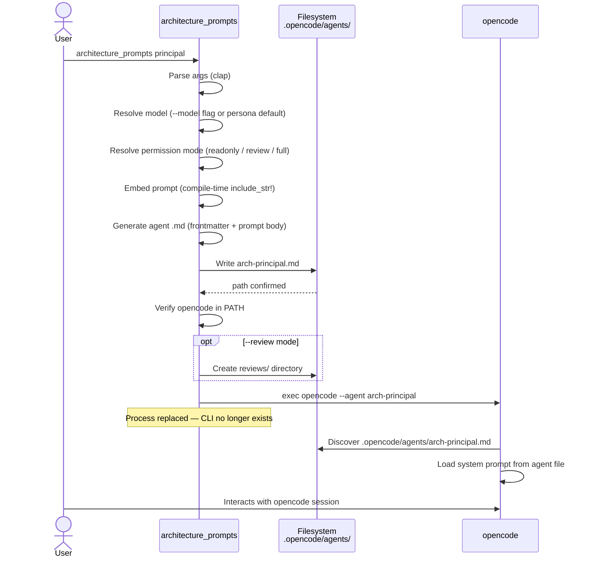
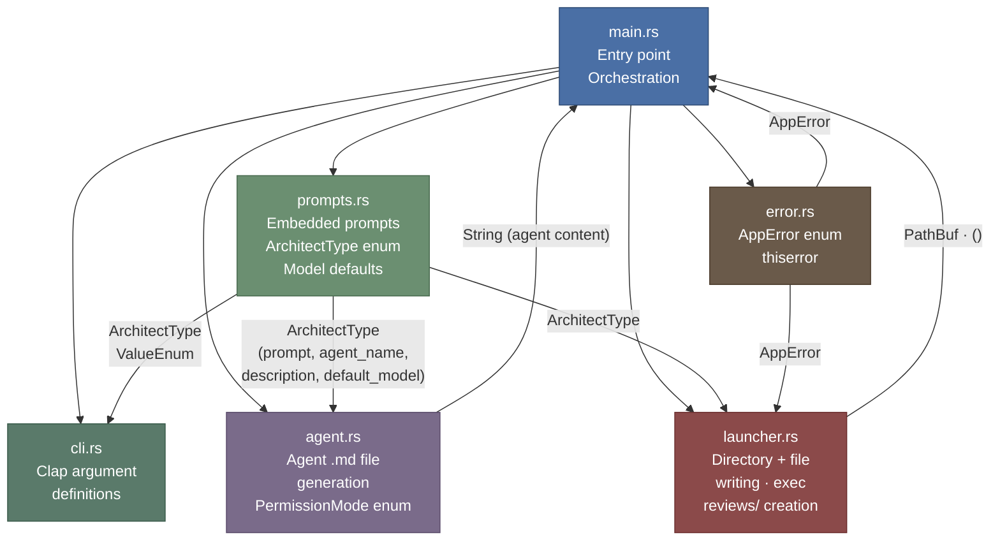
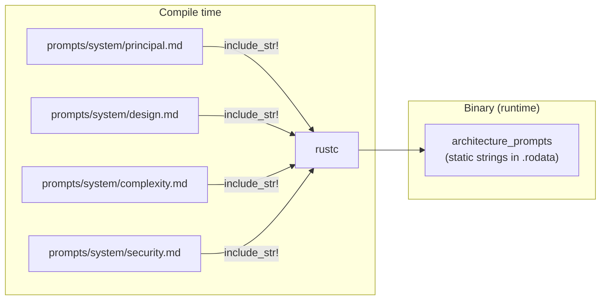
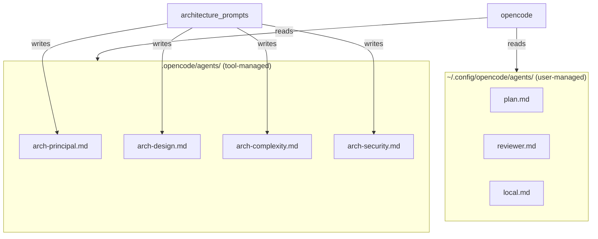
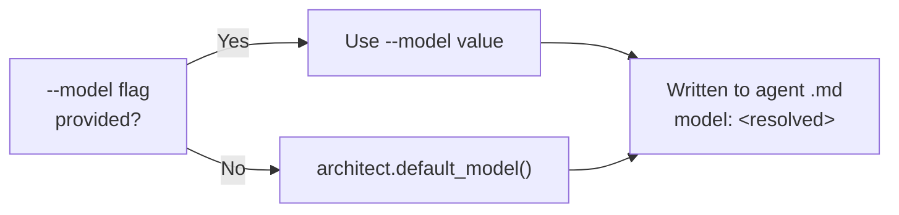
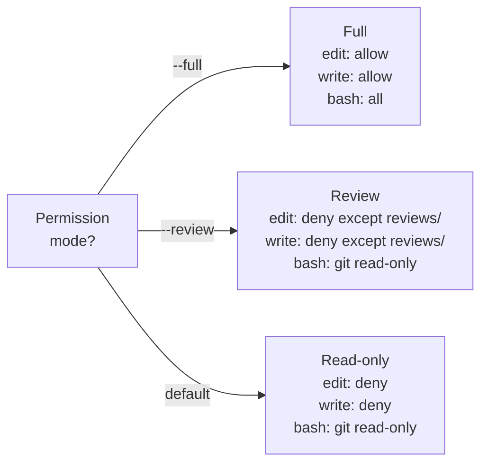
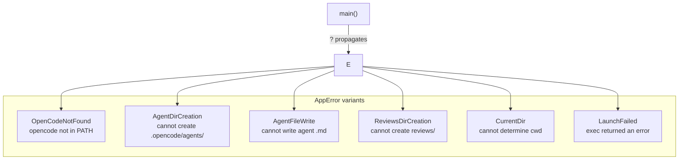
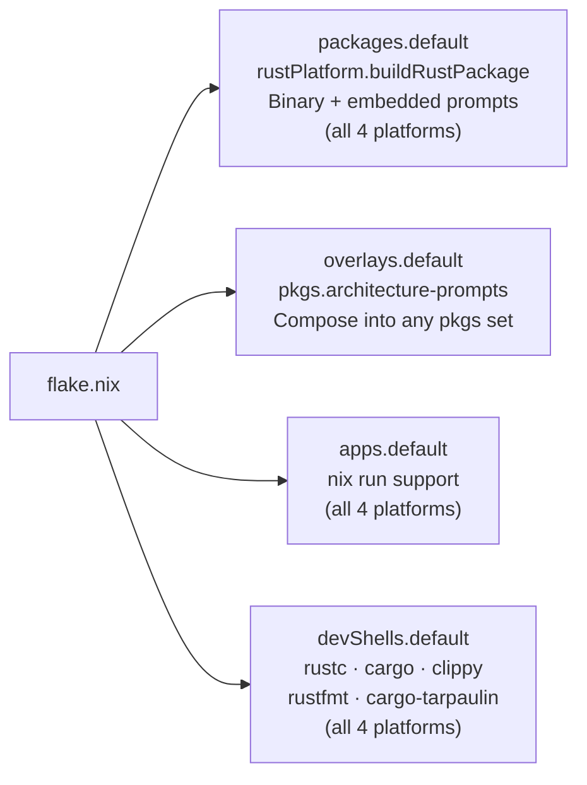
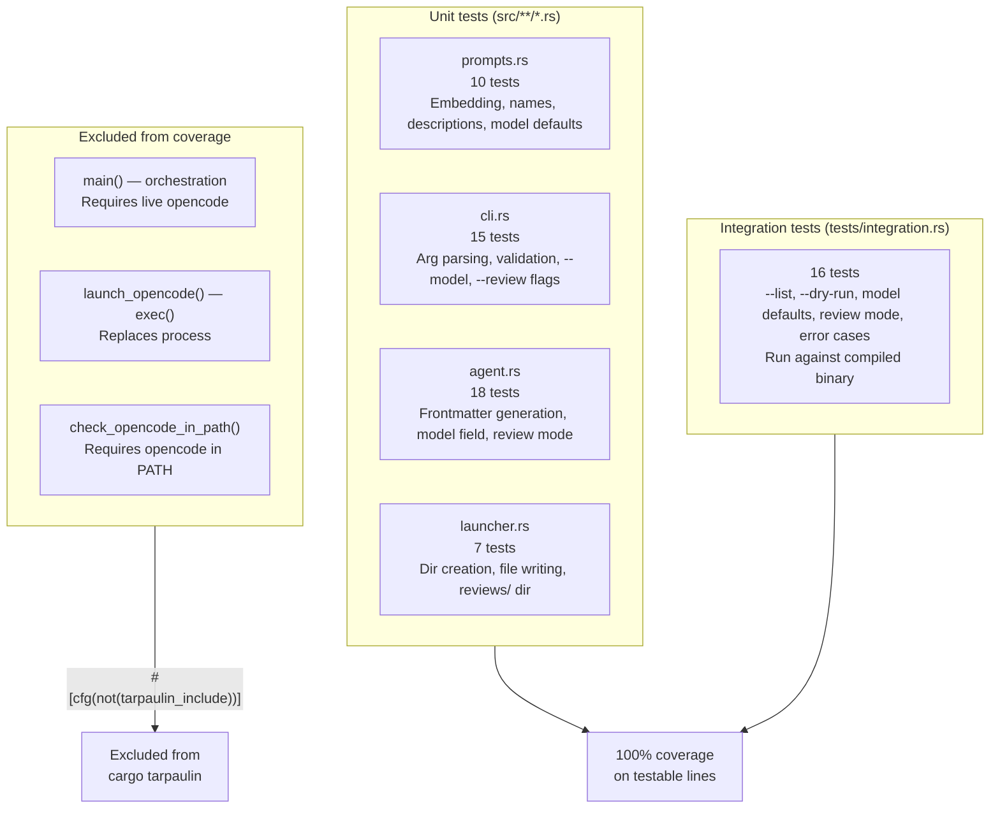

# Architecture

This document describes the internal architecture of the `architecture_prompts` tool: its components, data flow, module boundaries, design decisions, and Nix packaging model.

---

## System context

`architecture_prompts` is a thin launcher. It sits between the user and opencode, injecting a specialist system prompt into the opencode session by writing a project-local agent file and then replacing itself with the opencode process.



The tool has no network access of its own. It does not call any LLM API. All AI interaction happens inside opencode after the handoff.

---

## Runtime data flow



The critical detail is the `exec()` call: the Rust process is **replaced** by opencode, not spawned as a child. This means opencode inherits the terminal, all file descriptors, and the working directory cleanly. There is no Rust process running in the background.

---

## Module structure



### Module responsibilities

| Module | Responsibility | Key types |
|---|---|---|
| `main.rs` | Orchestration: parse → generate → write → exec | — |
| `cli.rs` | CLI argument definitions via `clap` derive | `Cli` |
| `prompts.rs` | Compile-time prompt embedding; persona catalogue; model defaults | `ArchitectType` |
| `agent.rs` | Generate the opencode agent `.md` file content; permission modes | `generate_agent_content()`, `PermissionMode` |
| `launcher.rs` | Create directories, write file, exec opencode | `ensure_agent_dir()`, `ensure_reviews_dir()`, `write_agent_file()`, `launch_opencode()` |
| `error.rs` | Typed error enum | `AppError` |

---

## Key design decisions

### Prompts embedded at compile time

The four system prompts are embedded into the binary using Rust's `include_str!()` macro:

```rust
const PRINCIPAL: &str = include_str!("../prompts/system/principal.md");
```

This means:

- The binary is self-contained — no runtime file lookup, no path configuration.
- The prompts are guaranteed to match the binary version. There is no drift between what is installed and what is in the repository.
- Changing a prompt requires recompiling. This is intentional: prompts are part of the release artifact, not runtime configuration.



### Process replacement via `exec()`

The launcher uses `std::os::unix::process::CommandExt::exec()` rather than `Command::spawn()`:

```rust
let err = Command::new("opencode")
    .args(["--agent", agent_name])
    .exec();
// exec() only returns on failure
Err(AppError::LaunchFailed(err))
```

`exec()` replaces the current process image with opencode. The Rust process ceases to exist. This is the correct approach for a launcher because:

- opencode gets full, unmediated terminal control (required for its TUI).
- There is no zombie Rust process consuming resources.
- Signal handling is opencode's responsibility, not ours.

The trade-off is that `exec()` is Unix-only. This is acceptable because all four target platforms (`x86_64-linux`, `aarch64-linux`, `x86_64-darwin`, `aarch64-darwin`) are Unix.

### Agent file written to project-local `.opencode/agents/`

opencode discovers agents from two locations:

- Global: `~/.config/opencode/agents/`
- Per-project: `<cwd>/.opencode/agents/`

The tool writes to the per-project location. This means:

- The architect agent is only active in the project where it was invoked.
- The user's global opencode configuration is never modified.
- Multiple projects can have different architect agents active simultaneously.

The generated file is named `arch-<persona>.md` (e.g., `arch-principal.md`) to avoid collisions with user-defined agents.



### Read-only permissions by default

The generated agent frontmatter denies file edits and restricts bash by default:

```yaml
permission:
  edit: deny
  write: deny
  bash:
    "*": deny
    "git log*": allow
    "git diff*": allow
    "git status": allow
  webfetch: ask
```

This is the right default for architect personas — they are evaluators, not implementers. The `--full` flag unlocks all permissions for cases where the persona should also produce output (e.g., writing an ADR).

### Per-persona model defaults

Each persona ships with a built-in default LLM model. The model is written to the `model:` field in the agent frontmatter and interpreted by opencode at session start.

| Persona | Default model | Rationale |
|---|---|---|
| `principal` | `github-copilot/claude-opus-4.6` | Broad system review needs maximum reasoning depth |
| `design` | `github-copilot/claude-opus-4.6` | Formal verdict needs strong judgment |
| `complexity` | `github-copilot/claude-sonnet-4.6` | Focused audit — Sonnet is fast and sufficient |
| `security` | `github-copilot/claude-sonnet-4.6` | Focused audit — Sonnet is fast and sufficient |

The resolution logic in `main.rs`:

```rust
let model = cli.model
    .as_deref()
    .unwrap_or_else(|| architect.default_model());
```

The `--model` / `-m` flag provides an escape hatch when defaults become stale or the user wants to experiment. No validation of the model string is performed by this tool — opencode validates the model at session start.



### Review mode: scoped write permissions

The `--review` flag introduces a third permission mode that uses opencode's path-based `edit` permission globs to scope writes to `reviews/arch-*.md` while keeping everything else read-only.

**Permission model:**

```yaml
permission:
  edit:
    "*": deny
    "reviews/arch-*.md": allow
  write:
    "*": deny
    "reviews/arch-*.md": allow
  bash:
    "*": deny
    "git log*": allow
    "git diff*": allow
    "git status": allow
  webfetch: ask
```

**Key design choices:**

- opencode's `edit` permission supports path-based glob patterns. The tool cannot distinguish "edit an existing file" vs "create a new file" — the permission model is path-based only. Scoping to `reviews/arch-*.md` achieves the intent: the persona can create its findings file but cannot touch any existing source, config, or documentation.
- Both `edit` and `write` keys are set with the same patterns defensively. Research shows `edit` covers both tools in current opencode, but setting both ensures correctness across versions.
- The `reviews/` directory is created by the tool before launching opencode, so the persona does not need bash permission for `mkdir -p`.
- A review-output instruction is appended to the prompt body at runtime, directing the persona to save its findings to `reviews/arch-<persona>-YYYY-MM-DD.md`. The LLM fills in today's date (available via opencode's session context).
- Timestamped filenames are chosen by the LLM. The glob `arch-*.md` is deliberately broad — any date format matches. This avoids hardcoding a date format in the tool.
- `--review` and `--full` are mutually exclusive (enforced by clap's `conflicts_with`).



---

## Error handling

All errors are typed via `AppError` and propagated with `?`. The binary exits with a non-zero code and a human-readable message on any error.



No `unwrap()` or `expect()` calls exist in production code paths. The only `expect()` in `main.rs` guards a condition that clap enforces statically (architect is `Some` when `--list` is not set).

---

## Nix packaging

The flake targets four platforms and provides four outputs on each:

| Platform | Description |
|---|---|
| `x86_64-linux` | 64-bit Linux (Intel/AMD) |
| `aarch64-linux` | 64-bit Linux (ARM) |
| `x86_64-darwin` | macOS (Intel) |
| `aarch64-darwin` | macOS (Apple Silicon) |



`nix build .` always builds for the **current host platform** — it resolves `packages.${builtins.currentSystem}.default`. No cross-compilation occurs.

### Source filtering

The Nix build uses `lib.fileset` to include only the files needed for compilation. This avoids cache invalidation from unrelated changes (e.g., editing this document does not trigger a rebuild):

```nix
src = fs.toSource {
  root = ./.;
  fileset = fs.unions [
    ./Cargo.toml
    ./Cargo.lock
    ./src          # Rust source
    ./prompts      # Embedded at compile time — must be included
  ];
};
```

The `prompts/` directory is explicitly included because `include_str!()` reads those files at compile time. Without it, the Nix sandbox would not find them.

### Dev shell

All five packages in the dev shell work on all four target platforms:

| Package | Purpose |
|---|---|
| `rustc` | Rust compiler |
| `cargo` | Build tool and package manager |
| `clippy` | Linter |
| `rustfmt` | Formatter |
| `cargo-tarpaulin` | Coverage tool (supported on Linux and macOS) |

### Consuming from another flake

```nix
# flake.nix of another project
{
  inputs = {
    nixpkgs.url = "github:NixOS/nixpkgs/nixos-unstable";
    architecture-prompts.url = "github:youruser/architecture_prompts";
  };

  outputs = { nixpkgs, architecture-prompts, ... }:
    let
      # Works on x86_64-linux, aarch64-linux, x86_64-darwin, aarch64-darwin
      forEachSystem = nixpkgs.lib.genAttrs [
        "x86_64-linux" "aarch64-linux" "x86_64-darwin" "aarch64-darwin"
      ];
    in {
      # Option A: direct package reference
      devShells = forEachSystem (system:
        let pkgs = nixpkgs.legacyPackages.${system}; in {
          default = pkgs.mkShell {
            packages = [
              architecture-prompts.packages.${system}.default
            ];
          };
        }
      );

      # Option B: via overlay (adds pkgs.architecture-prompts to all systems)
      # nixpkgs.overlays = [ architecture-prompts.overlays.default ];
    };
}
```

### opencode is not a Nix dependency

opencode is managed outside Nix and must be present in `PATH` at runtime. The binary checks for it at startup and returns `AppError::OpenCodeNotFound` with a clear message if it is missing. This keeps the Nix closure small and avoids version coupling between this tool and opencode.

---

## Test architecture



The integration tests run the compiled binary as a subprocess and inspect stdout/stderr. They use `--dry-run` and `--list` to exercise the full code path without requiring opencode to be installed in the test environment.

Functions that call `exec()` or spawn the live opencode binary are excluded from coverage with `#[cfg(not(tarpaulin_include))]`. This is the correct approach: these functions cannot be unit-tested without a live opencode binary, and their behavior is verified by the integration tests in environments where opencode is available.
