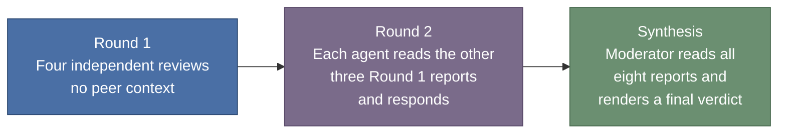
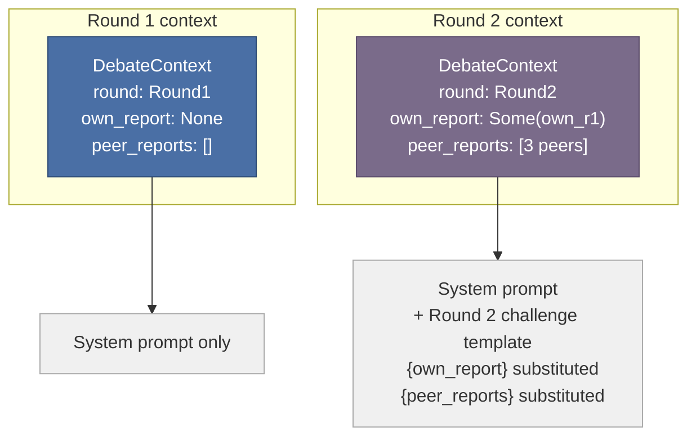
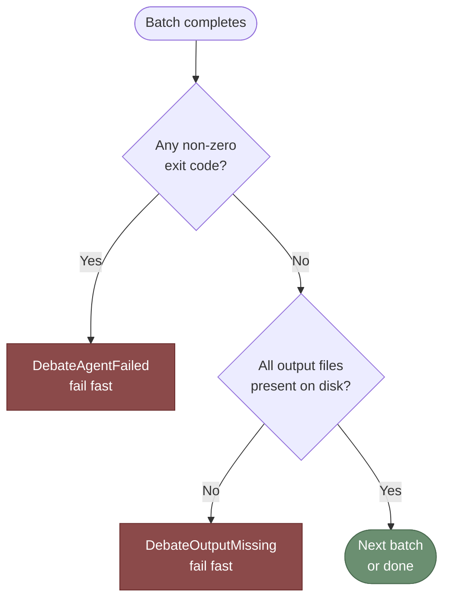

# Debate Mode

`architecture_prompts` supports a **multi-round architect debate**: all four
architect personas review the codebase independently, challenge each other's
findings in a second round, and a synthesis moderator produces a final verdict.

The debate produces richer, more reliable architectural feedback than a single
persona run because it surfaces disagreements, prevents premature consensus, and
forces each persona to justify its claims against peer scrutiny.

---

## Concept

A standard single-agent review is a monologue: one persona, one pass, no
challenge. The debate is a structured protocol:



Each round is run by a freshly generated opencode agent file with permissions
scoped to its expected output path. No agent can read or modify another agent's
output file directly — all cross-agent context is injected into the agent body
by the orchestrator.

---

## Protocol

### Round 1 — Independent Assessment

Each of the four architect personas (`principal`, `design`, `complexity`,
`security`) is given its standard system prompt and told to write its findings
to `reviews/round1/arch-<name>.md`.

No peer context is injected. The goal is an unbiased first pass.

**Permission model:**
- Read-only for all repo files and the codebase
- Write allowed only to `reviews/round1/arch-*.md`
- Bash restricted to read-only `git` commands (`git log*`, `git diff*`, `git status`)
- `webfetch: ask` — agents may look up library documentation

### Round 2 — Peer Challenge

Each persona is given:
1. Its own Round 1 report
2. The three peer Round 1 reports
3. The Round 2 challenge instruction template

The challenge template instructs the agent to:
- Re-read its own findings critically
- Challenge peer claims it disagrees with (with reasons)
- Explicitly endorse peer claims it agrees with
- Surface new observations hinted at by the peer reports

Output goes to `reviews/round2/arch-<name>.md`.

**Permission model:**
- Write allowed only to `reviews/round2/arch-*.md`
- `webfetch: deny` — all context is already injected inline; external fetches would be noise

### Synthesis — Moderator Report

The moderator agent receives all eight reports (4 Round 1 + 4 Round 2) injected
inline and produces `reviews/final-report.md`.

The moderator:
- Identifies **Confirmed Findings** (three or more personas agree)
- Identifies **Contested Findings** (substantial disagreement)
- Lists **Unresolved Questions**
- Produces a **Risk Register** with severity ratings
- Recommends **Next Steps** in priority order

**Permission model:**
- Write allowed only to `reviews/final-report.md`
- No bash access
- `webfetch: deny`

---

## CLI Reference

### Basic usage

```bash
# Run the full debate pipeline in the current directory
architecture_prompts --debate
```

### With options

```bash
# Limit to 2 concurrent opencode processes per round
architecture_prompts --debate --concurrency 2

# Override the LLM model for all debate agents
architecture_prompts --debate --model github-copilot/claude-sonnet-4.6

# Combine model override and concurrency limit
architecture_prompts --debate --model openai/gpt-5 --concurrency 1

# Designate the complexity architect as devil's advocate in Round 2
architecture_prompts --debate --devils-advocate complexity
```

### Flag reference

| Flag | Default | Description |
|------|---------|-------------|
| `--debate` | `false` | Enable the multi-round debate pipeline. Mutually exclusive with all single-agent flags and the positional `ARCHITECT` argument. |
| `--concurrency <N>` | `4` | Max parallel `opencode run` processes per round. Requires `--debate`. Zero is treated as 1. |
| `--model <PROVIDER/MODEL>` | per-persona default | Override the LLM model for all agents in this run. |
| `--devils-advocate <ARCHITECT>` | `None` | Designate one architect (`principal`\|`design`\|`complexity`\|`security`) as the devil's advocate for Round 2. Requires `--debate`. |

### Conflicts

`--debate` is mutually exclusive with: `--full`, `--review`, `--dry-run`, `--clean`, and the positional `ARCHITECT` argument.

`--concurrency` is only valid with `--debate`.

`--devils-advocate` is only valid with `--debate`.

### Exit behaviour

- Exits **0** on success (all nine output files produced).
- Exits **1** if opencode is not in `PATH` (`opencode not found in PATH`).
- Exits **1** if any `opencode run` subprocess exits non-zero (`debate round N agent … failed`).
- Exits **1** if an expected output file is absent after a subprocess exits 0 (`debate round N agent … did not produce expected output`).

---

## Output Structure

After a full debate run, the `reviews/` directory contains:
```
reviews/
├── round1/
│   ├── arch-principal.md
│   ├── arch-design.md
│   ├── arch-complexity.md
│   └── arch-security.md
├── round2/
│   ├── arch-principal.md
│   ├── arch-design.md
│   ├── arch-complexity.md
│   └── arch-security.md
└── final-report.md
```

The `final-report.md` is the primary deliverable. The per-round files are
retained for auditability and to allow manual inspection of how findings evolved
across rounds.

---

## Type Model

The debate pipeline is built on three core types in `src/debate_agent.rs`:

### `DebateRound`

```rust
pub enum DebateRound {
    Round1,
    Round2,
}
```

Controls which agent file variant `generate_debate_agent()` produces.

### `PeerReport<'a>`

```rust
pub struct PeerReport<'a> {
    pub agent_name: &'a str,  // e.g., "arch-principal"
    pub content: &'a str,     // full report text
}
```

A named report slice used for context injection. The lifetime ties the report
to the string data it borrows — no heap allocation for context that already
lives in memory.

### `DebateContext<'a>`

```rust
pub struct DebateContext<'a> {
    pub round: DebateRound,
    pub own_report: Option<&'a str>,
    pub peer_reports: Vec<PeerReport<'a>>,
    pub is_devils_advocate: bool,
}
```

| Round  | `own_report` | `peer_reports`     | `is_devils_advocate`          |
|--------|--------------|--------------------|-------------------------------|
| Round1 | `None`       | empty              | `false`                       |
| Round2 | `Some(…)`    | three peer reports | `true` for designated persona |

### `DebateRole`

```rust
pub enum DebateRole {
    Moderator,
}
```

Intentionally separate from `ArchitectType`. `ArchitectType` derives
`clap::ValueEnum` and is exposed as a user-facing CLI argument. The moderator
is never invoked standalone — it exists only inside the debate pipeline.
Mixing it into `ArchitectType` would pollute the help text and require
special-casing in existing single-agent code paths.

---

## Devil's Advocate Mode

When `--devils-advocate <ARCHITECT>` is set, the designated persona uses a
different Round 2 template (`prompts/debate/round2_devils_advocate.md`) instead
of the standard balanced challenge/endorse template.

**What the devil's advocate does in Round 2:**
1. Identifies consensus positions that appear across two or more peer reports.
2. Constructs the strongest plausible counter-argument for each consensus claim.
3. Surfaces implicit assumptions in the consensus as risks.
4. Proposes at least one alternative interpretation of the evidence.
5. Notes any own Round 1 finding that contradicts the emerging consensus.

The adversarial challenges must be grounded and arguable — the goal is
stress-testing, not sabotage.

**Moderator notice:**

When a devil's advocate is designated, the moderator agent file receives a
"Devil's Advocate Notice" prepended to the reports section. This tells the
moderator that the designated persona's Round 2 report is adversarial by design
and should be weighted as a stress-test rather than a sincere disagreement.

**Output path:**

The devil's advocate still writes to `reviews/round2/arch-<name>.md` — the same
path as any other Round 2 agent. The adversarial nature is signalled by the
moderator notice, not by a separate file.

---

## Context Injection



The `{own_report}` and `{peer_reports}` placeholders in
`prompts/debate/round2_challenge.md` are substituted at generation time by
`generate_debate_agent()`. No template engine is used — plain `str::replace`
on the two known placeholder strings.

---

## Moderator Token Budget

The moderator receives all eight reports inline. With reports averaging ~2,000
tokens each, the input is roughly 16,000–40,000 tokens depending on report
verbosity. This fits comfortably within the context window of `claude-opus-4.6`
(the moderator's default model).

If reports are significantly longer than expected, future versions may add a
`## Key Claims` summary header to each report to reduce the effective input
size.

---

## Orchestration Engine (`src/debate.rs`)

### `DebateConfig`

```rust
pub struct DebateConfig {
    pub model: Option<String>,          // global model override (None = per-persona default)
    pub concurrency: usize,             // max parallel opencode processes per round
    pub base_dir: PathBuf,              // working directory
    pub devils_advocate: Option<ArchitectType>, // Phase 4: devil's advocate designation
}
```

### `ProcessRunner` trait

Subprocess interaction is hidden behind a trait so orchestration logic can be
unit-tested with a `MockRunner` that writes synthetic output files instead of
calling opencode:

```rust
pub trait ProcessRunner: Send + Sync {
    fn run_agent(&self, agent_name: &str, prompt: &str) -> Result<(), AppError>;
}
```

`RealRunner` (production) calls `opencode run --agent <name> "<prompt>"`.
`MockRunner` (tests) writes placeholder files to the expected output paths.

### Concurrency control

`run_round1` and `run_round2` split the four agents into chunks of at most
`config.concurrency` and run each chunk in parallel using `std::thread::scope`.
All threads in a chunk complete before the next chunk starts (fail-fast at
chunk boundaries, not mid-chunk).

```
4 agents, concurrency=4  →  1 batch of 4 parallel threads
4 agents, concurrency=2  →  2 batches of 2 parallel threads each
4 agents, concurrency=1  →  4 sequential single-thread batches
```

Zero is silently treated as 1 to avoid a `chunks(0)` panic.

### Fail-fast verification

After every batch, `verify_round_outputs` checks that each expected output file
exists on disk.  Output file existence is checked **in addition to** exit code
because `opencode run` may exit 0 even when the LLM declines to write output.
The file check is the authoritative signal.



### Error variants

| Error | When |
|-------|------|
| `DebateAgentFailed { round, agent, code }` | `opencode run` exits non-zero |
| `DebateOutputMissing { round, agent, path }` | expected output file absent after run |
| `DebateReportRead { path, source }` | cannot read a previous round's report file |
| `DebateRoundDirCreation(io::Error)` | cannot create `reviews/round1/` or `reviews/round2/` |
| `DebateSpawnFailed(io::Error)` | cannot spawn the `opencode` subprocess |

### `run_debate` call graph

```mermaid
graph TD
    RD["run_debate(config, runner)"]

    RD --> ERD["ensure_round_dirs()\ncreates reviews/round1/\nand reviews/round2/"]
    RD --> RR1["run_round1(config, runner)"]
    RD --> RR2["run_round2(config, runner)"]
    RD --> RS["run_synthesis(config, runner)"]

    RR1 --> RR1A["generate_debate_agent() ×4\nbuilds Round 1 agent files"]
    RR1 --> RR1B["write_named_agent_file() ×4\nwrites to .opencode/agents/"]
    RR1 --> RR1C["spawn_batch()\nruns up to concurrency\nagents in parallel"]
    RR1 --> RR1D["verify_round_outputs()\nchecks reviews/round1/\narch-*.md exist"]

    RR2 --> RR2A["read round1 reports ×4"]
    RR2 --> RR2B["generate_debate_agent() ×4\nbuilds Round 2 agent files\nwith peer context"]
    RR2 --> RR2C["write_named_agent_file() ×4"]
    RR2 --> RR2D["spawn_batch()"]
    RR2 --> RR2E["verify_round_outputs()\nchecks reviews/round2/\narch-*.md exist"]

    RS --> RSA["read all 8 reports"]
    RS --> RSB["generate_moderator_agent()\nbuilds moderator agent file"]
    RS --> RSC["write_named_agent_file()"]
    RS --> RSD["spawn_batch()\nruns arch-moderator"]
    RS --> RSE["verify final-report.md exists"]

    style RD  fill:#4a6fa5,color:#fff,stroke:#2d4a73
    style RR1 fill:#7a6b8a,color:#fff,stroke:#5a4b6a
    style RR2 fill:#7a6b8a,color:#fff,stroke:#5a4b6a
    style RS  fill:#6b8f71,color:#fff,stroke:#4a6b50
```



---

## Files Added in Phase 1

| File | Purpose |
|------|---------|
| `src/debate_agent.rs` | Core types (`DebateRound`, `DebateContext`, `PeerReport`) and agent generation functions |
| `src/prompts.rs` | `DebateRole` enum added (moderator agent name, description, model, prompt) |
| `prompts/system/moderator.md` | Moderator system prompt embedded at compile time |
| `prompts/debate/round2_challenge.md` | Round 2 challenge instruction template with `{own_report}` and `{peer_reports}` placeholders |
| `docs/debate.md` | This document |

## Files Added in Phase 2

| File | Purpose |
|------|---------|
| `src/debate.rs` | Orchestration engine: `DebateConfig`, `ProcessRunner` trait, `RealRunner`, `MockRunner` (tests), `ensure_round_dirs`, `run_round1/2/synthesis`, `run_debate`, `spawn_batch` |
| `src/error.rs` | Five new `AppError` variants: `DebateAgentFailed`, `DebateOutputMissing`, `DebateReportRead`, `DebateRoundDirCreation`, `DebateSpawnFailed` |

## Files Changed in Phase 3

| File | Change |
|------|--------|
| `src/cli.rs` | Added `--debate` flag and `--concurrency <N>` flag; added `"debate"` to `required_unless_present_any` on `ARCHITECT`; 11 new unit tests |
| `src/main.rs` | Wired debate branch: `check_opencode_in_path` → `DebateConfig` → `run_debate(&config, &RealRunner)` |
| `src/debate.rs` | Removed `#![allow(dead_code)]`; added `#[allow(dead_code)]` on `devils_advocate` field (reserved for Phase 4) |
| `src/debate_agent.rs` | Removed `#![allow(dead_code)]` |
| `src/prompts.rs` | Removed `#[allow(dead_code)]` from `MODERATOR`, `DebateRole`, `impl DebateRole` |
| `tests/integration.rs` | Added `debate_flag_does_not_require_architect_arg` (non-ignored) and `debate_pipeline_runs_end_to_end` (`#[ignore]`) |
| `README.md` | Added debate introduction, updated CLI reference, added `--debate` examples section, updated permission modes table |
| `docs/debate.md` | Added CLI Reference section (flags, conflicts, exit behaviour) |

## Files Changed in Phase 4

| File | Change |
|------|--------|
| `prompts/debate/round2_devils_advocate.md` | New adversarial Round 2 template with `{own_report}` and `{peer_reports}` placeholders |
| `src/debate_agent.rs` | Added `ROUND2_DEVILS_ADVOCATE` const; `is_devils_advocate: bool` field on `DebateContext`; `generate_round2_agent()` branches on flag; `generate_moderator_agent()` accepts `devils_advocate: Option<&str>` and prepends DA notice; 11 new unit tests |
| `src/debate.rs` | `run_round2` sets `is_devils_advocate: config.devils_advocate == Some(architect)`; `run_synthesis` passes DA name to `generate_moderator_agent`; `#[allow(dead_code)]` removed from `devils_advocate` field; 4 new unit tests |
| `src/cli.rs` | Added `--devils-advocate <ARCHITECT>` flag (`Option<ArchitectType>`, `value_enum`, `requires = "debate"`); 4 new unit tests |
| `src/main.rs` | Passes `cli.devils_advocate` into `DebateConfig` |
| `src/prompts.rs` | `ArchitectType` now derives `PartialEq, Eq` (required for `== Some(architect)` comparison) |
| `tests/integration.rs` | Added `debate_with_devils_advocate_parses_without_clap_error` and `devils_advocate_without_debate_is_rejected` |
| `README.md` | Updated CLI reference synopsis, options table, and debate mode section with `--devils-advocate` |
| `docs/debate.md` | Updated `DebateContext` type model table; added Devil's Advocate Mode section; updated CLI reference table and Conflicts; added this change-log |
