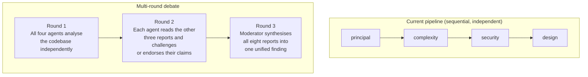
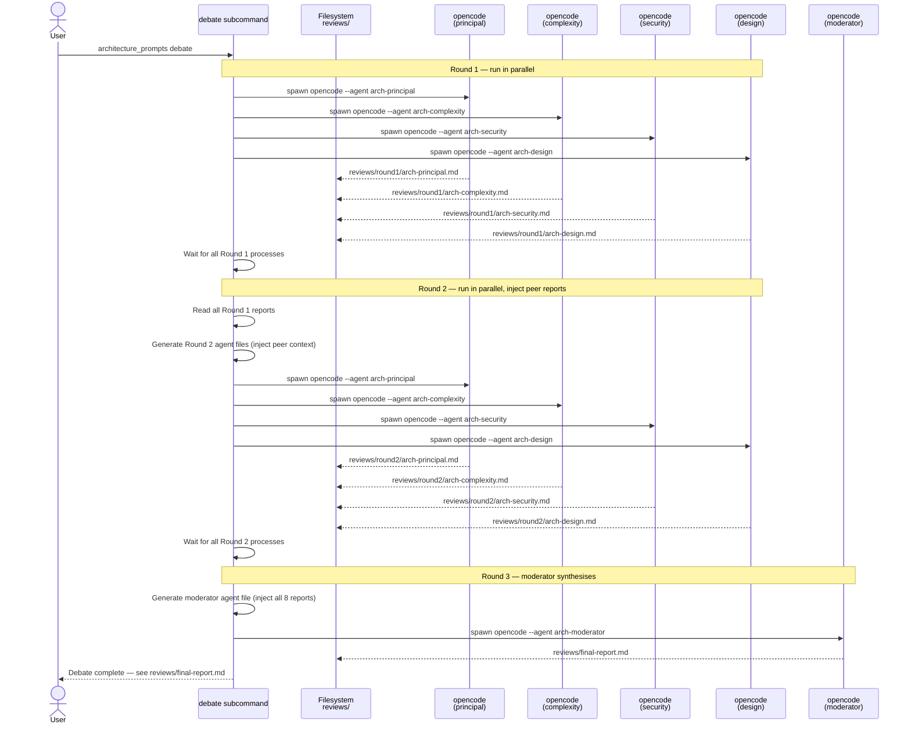
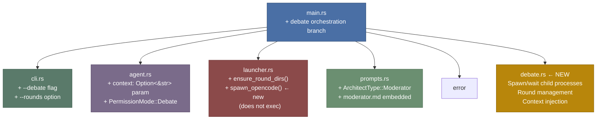

# Multi-Round Architect Debate

This document describes a proposed extension to `architecture_prompts` that runs the four architect personas in a structured multi-round debate, where agents read and challenge each other's findings before a moderator synthesises a unified report.

The design is based on the **Multi-Agent Debate (MAD)** pattern described in [Liang et al., EMNLP 2024](https://arxiv.org/abs/2305.19118): multiple agents argue "tit for tat" while a judge manages the process and determines when to stop. The paper demonstrates that this produces better outcomes than self-reflection alone, because independent agents can break each other out of incorrect positions that a single agent would entrench.

---

## Why multi-round debate

The existing `--review` pipeline runs each persona sequentially and independently. Each agent sees only the codebase — not what the others found. This means:

- The `security` agent might flag a trust boundary that the `principal` agent dismissed as acceptable risk, but neither agent knows the other's position.
- The `complexity` agent might identify an abstraction layer as accidental complexity while the `design` agent considers it essential — with no way to resolve the disagreement.
- The `design` agent renders a final verdict without knowing which findings the other three agree on and which are contested.

The multi-round approach surfaces these conflicts explicitly, forces each agent to defend or revise its position in light of the others', and gives the final synthesis a much richer picture of where the panel agrees, where it disagrees, and why.



---

## Protocol

### Round 1 — Independent analysis

Each of the four agents reads the codebase and produces its findings independently, exactly as `--review` mode does today. No agent sees the others' output at this stage.

Output directory: `reviews/round1/`

| Agent | Output file |
|---|---|
| `principal` | `reviews/round1/arch-principal.md` |
| `complexity` | `reviews/round1/arch-complexity.md` |
| `security` | `reviews/round1/arch-security.md` |
| `design` | `reviews/round1/arch-design.md` |

The four agents can run in parallel — there are no dependencies between them in this round.

---

### Round 2 — Challenge and comment

Each agent is re-invoked with a modified system prompt that:

1. Reminds the agent of its own Round 1 findings (by including the file content).
2. Presents the other three agents' Round 1 findings.
3. Instructs the agent to respond with challenges, endorsements, and gaps.

The Round 2 instruction appended to each persona's prompt looks like this:

```
## Round 2 — Challenge and Comment

You have completed your initial analysis (Round 1). You are now in a structured
debate with three peer architects who have also reviewed the same codebase.

Their Round 1 findings are attached below.

Your task:
- Challenge any claim you disagree with. State your reasoning explicitly.
- Endorse claims from other agents that align with or strengthen your own findings.
- Identify anything the other agents missed that falls within your area of focus.
- Do not soften disagreements. If another agent is wrong, say so and explain why.

Be specific: quote or reference the claim you are responding to.

### arch-principal Round 1
<contents of reviews/round1/arch-principal.md>

### arch-complexity Round 1
<contents of reviews/round1/arch-complexity.md>

### arch-security Round 1
<contents of reviews/round1/arch-security.md>

### arch-design Round 1
<contents of reviews/round1/arch-design.md>
```

Each agent omits its own Round 1 report from the "peer findings" list — it already knows its own position.

Output directory: `reviews/round2/`

| Agent | Output file |
|---|---|
| `principal` | `reviews/round2/arch-principal.md` |
| `complexity` | `reviews/round2/arch-complexity.md` |
| `security` | `reviews/round2/arch-security.md` |
| `design` | `reviews/round2/arch-design.md` |

The four Round 2 agents can also run in parallel — each depends only on the Round 1 outputs, which are all complete before Round 2 begins.

---

### Round 3 — Synthesis

A fifth agent, the **moderator**, reads all eight reports (four from Round 1, four from Round 2) and produces a single unified document.

The moderator is not one of the four architect personas. It is a new persona focused solely on synthesis and conflict resolution. Its prompt instructs it to:

- Identify claims that all four agents agree on (high-confidence findings).
- Surface contested claims, presenting each side's argument without resolving them itself.
- Rank findings by severity and panel consensus.
- Note questions that remain unresolved after two rounds.
- Render an overall verdict, weighted by the Design board's formal `Accept / Accept with concerns / Reject` plus the other agents' positions.

Output: `reviews/final-report.md`

---

## Full data flow



---

## Key technical challenges

### 1. Spawn vs exec

The current launcher uses `exec()` in `src/launcher.rs`, which replaces the Rust process with opencode. This is correct for the single-agent case but is incompatible with multi-round orchestration: after `exec()` the Rust process no longer exists and cannot wait for the session to complete, read its output, or start the next round.

The `debate` subcommand must use `Command::spawn()` instead of `exec()`. The Rust process remains alive, manages the lifecycle of each opencode subprocess, and waits for each one to exit before proceeding.

```rust
// Current (single-agent): process is replaced
Command::new("opencode").args(["--agent", name]).exec();

// Required (multi-round): process supervises children
let child = Command::new("opencode")
    .args(["--agent", name])
    .spawn()?;
child.wait()?;
```

This has one important consequence: opencode's TUI will not work cleanly when its parent process is managing multiple children. The debate subcommand should run opencode in a **non-interactive batch mode** if opencode supports it — for example, passing an initial prompt via stdin or a flag so that opencode runs headlessly, produces its output file, and exits. If opencode does not yet support a headless mode, the user would need to interact with each session manually, which defeats the automation goal.

### 2. Context injection

Round 2 requires each agent's system prompt to include the full content of the other three agents' Round 1 reports. There are two approaches:

**Inline injection (simple, token-heavy):** Read the Round 1 report files and concatenate their contents into the system prompt at agent-file-generation time. The agent file becomes large — potentially 4,000–8,000 tokens of context before the agent writes a single word — but no additional tooling is required.

**Reference injection (leaner, requires file-read permission):** Include the file paths in the prompt and grant the agent read permission for `reviews/round1/*.md`. The agent reads the files itself at the start of its session. This keeps the system prompt smaller but introduces a dependency on the agent actually reading the files before producing output.

The inline approach is recommended for the first implementation: it is deterministic and does not rely on agent behaviour.

### 3. Token budget

By Round 2 each agent ingests approximately:
- Its own Round 1 report (~1,000–3,000 tokens)
- Three peer Round 1 reports (~3,000–9,000 tokens combined)
- Its original system prompt (~300 tokens)
- The Round 2 instruction (~400 tokens)

Total input: ~5,000–13,000 tokens per Round 2 agent. This is within the context window of all target models but is not free. The moderator in Round 3 reads all eight reports, which could reach 20,000–40,000 tokens of input.

If token cost is a concern, Round 1 reports can be preceded by a **structured summary header** — each agent writes a `## Key claims` section with 5–10 bullet points before its full analysis. Round 2 and Round 3 agents can be instructed to read the key-claims sections first and use the full text only for specific challenges.

### 4. Adaptive stopping

The MAD paper found that a fixed number of rounds is suboptimal. If agents converge quickly — their Round 2 responses are largely endorsements with no new challenges — running additional rounds adds cost without improving quality.

A simple adaptive heuristic: after Round 2, the moderator checks whether any Round 2 response contains phrases indicating genuine disagreement (e.g., "I disagree", "this is incorrect", "the [persona] agent overlooked"). If no substantive challenges appear, the moderator skips to synthesis. If significant disagreements remain, a Round 3 challenge pass can be triggered before synthesis.

For the initial implementation, a fixed two-round debate (Round 1 + Round 2 + synthesis) is sufficient.

---

## New components required

### `debate` subcommand

A new CLI flag `--debate` (or subcommand) that orchestrates the full pipeline. It does not `exec` — it manages child processes.

```
architecture_prompts --debate              # full two-round debate
architecture_prompts --debate --rounds 1   # Round 1 only (equivalent to running all four --review)
architecture_prompts --debate --model github-copilot/claude-opus-4.6  # override model for all agents
```

### Round-aware agent file generation

`generate_agent_content()` in `src/agent.rs` needs a new variant that accepts an optional `context: &str` block to inject into the prompt body. This is used in Round 2 to inject peer reports and the challenge instruction.

### New `PermissionMode` variant

A new `PermissionMode::Debate` that allows writing to `reviews/round1/arch-*.md`, `reviews/round2/arch-*.md`, and `reviews/final-report.md`, while keeping the codebase read-only.

```yaml
permission:
  edit:
    "*": deny
    "reviews/round1/arch-*.md": allow
    "reviews/round2/arch-*.md": allow
    "reviews/final-report.md": allow
  write:
    "*": deny
    "reviews/round1/arch-*.md": allow
    "reviews/round2/arch-*.md": allow
    "reviews/final-report.md": allow
  bash:
    "*": deny
    "git log*": allow
    "git diff*": allow
    "git status": allow
  webfetch: ask
```

### Moderator persona

A new `ArchitectType::Moderator` with its own system prompt embedded at compile time in `prompts/system/moderator.md`. The moderator has a different character from the four architect personas: it does not evaluate the codebase directly, it evaluates the debate.

Draft prompt:

> You are a debate moderator and synthesis architect.
>
> You have received two rounds of findings from four specialist architects (principal, complexity, security, design) who have reviewed the same codebase.
>
> Your task is to produce a single unified report from their debate.
>
> Structure your report as follows:
> 1. **Consensus findings** — claims that all four agents agree on. These are high-confidence.
> 2. **Contested findings** — claims where agents disagreed. For each: state both positions and which agents hold each.
> 3. **Severity-ranked recommendations** — a flat list of all actionable findings, ordered by risk/impact.
> 4. **Unresolved questions** — issues that were raised but not resolved in two rounds.
> 5. **Overall verdict** — synthesise the Design board's formal verdict with the other agents' positions.
>
> Rules:
> - Do not introduce new findings of your own.
> - Do not resolve contested findings by picking a side — present both.
> - Be concise: stakeholders read this report, not the transcripts.

---

## Module changes overview



The biggest new module is `debate.rs`, which owns the round orchestration logic and is the only place that knows about the multi-round protocol. All other modules see only incremental additions.

---

## Output structure

After a complete debate run, the `reviews/` directory looks like this:

```
reviews/
├── round1/
│   ├── arch-principal.md
│   ├── arch-complexity.md
│   ├── arch-security.md
│   └── arch-design.md
├── round2/
│   ├── arch-principal.md
│   ├── arch-complexity.md
│   ├── arch-security.md
│   └── arch-design.md
└── final-report.md
```

The `--clean` flag does not touch `reviews/`. If you want to remove debate output, delete the `reviews/` directory manually or add a `--clean-reviews` flag.

---

## Variations worth considering

### Targeted pairings

Instead of every agent commenting on all three others, pair agents by domain overlap:

| Pairing | Rationale |
|---|---|
| `security` challenges `principal` | Security often disagrees with system-level trade-offs that accept implicit trust |
| `complexity` challenges `design` | Complexity often finds that Design's formal structures introduce accidental layers |
| `principal` challenges `security` | Principal may push back on security controls that add operational complexity |
| `design` challenges `complexity` | Design may defend necessary abstractions that Complexity wants to remove |

This halves the Round 2 token cost and focuses challenges where the most productive disagreements tend to arise.

### Confidence scoring

Each agent rates its Round 1 claims on a 1–3 scale (low / medium / high confidence). Round 2 focuses only on low- and medium-confidence claims from other agents. High-confidence claims are not challenged unless the reading agent has a specific counter-argument.

This reduces noise: agents will not waste tokens agreeing with things they already agree with.

### Devil's advocate mode

One of the four agents (typically `complexity`) is designated as the devil's advocate for Round 2. Regardless of its actual Round 1 findings, it is instructed to challenge the strongest claims from the other three agents, even if it agrees with them. This prevents premature convergence on a consensus that is actually groupthink.

---

## Relationship to the existing pipeline

The debate subcommand is additive. The existing single-agent invocation (`architecture_prompts principal --review`) continues to work exactly as before. The debate mode is a separate, higher-cost path for situations where the stakes are high enough to warrant full multi-agent scrutiny:

| Mode | Cost | Depth | Use case |
|---|---|---|---|
| Single agent, no `--review` | Low | Shallow | Quick interactive exploration |
| Single agent, `--review` | Low | Shallow | Saved findings for one perspective |
| All four agents, `--review` (manual pipeline) | Medium | Medium | Independent multi-perspective review |
| `--debate` (this document) | High | Deep | High-stakes decision with explicit disagreement surfaced |
