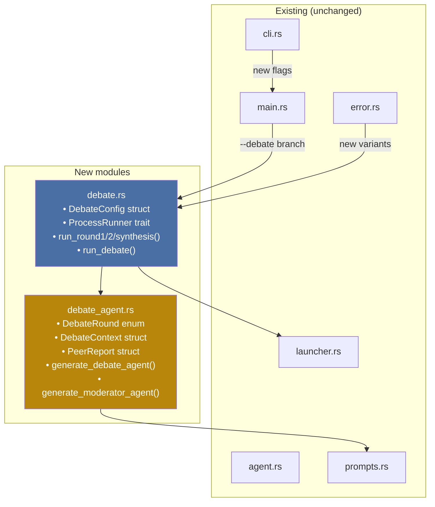
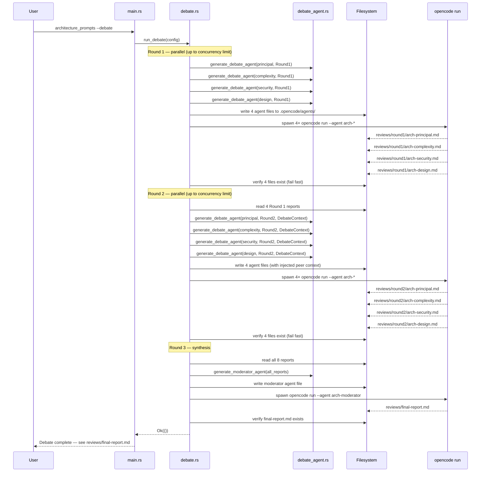
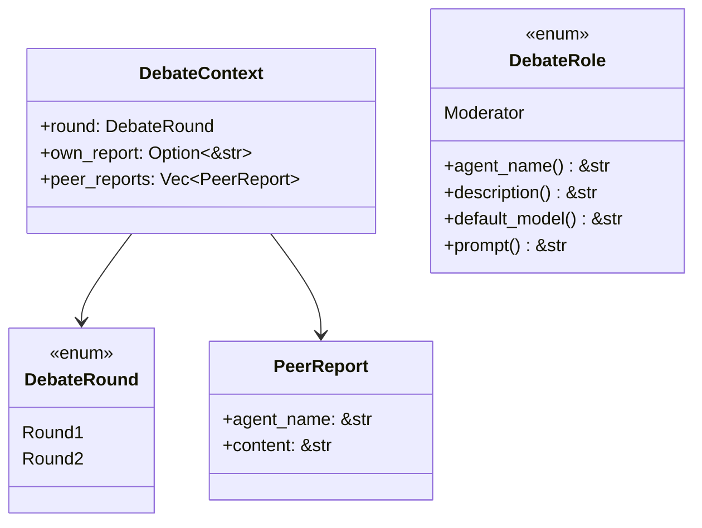
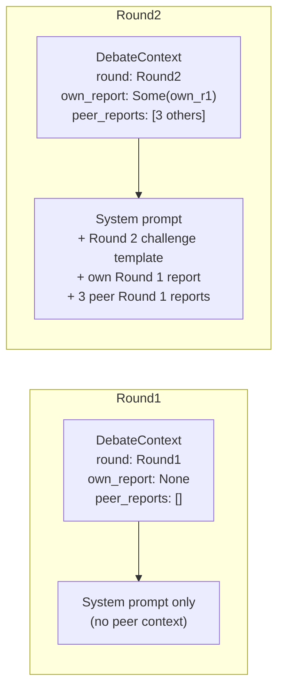
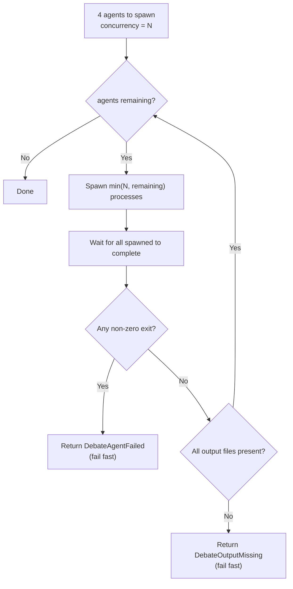
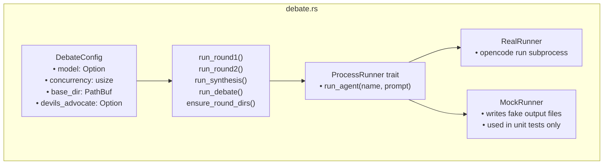
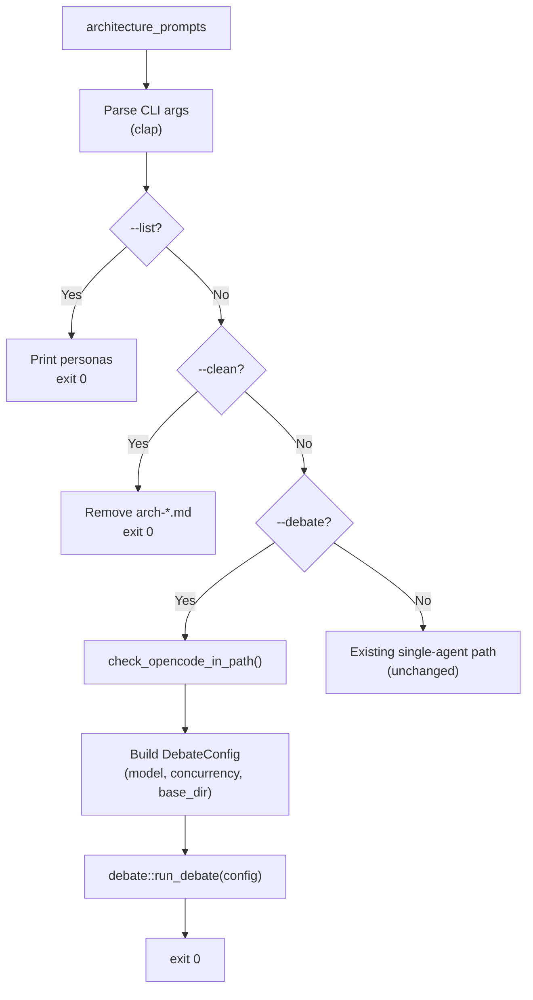
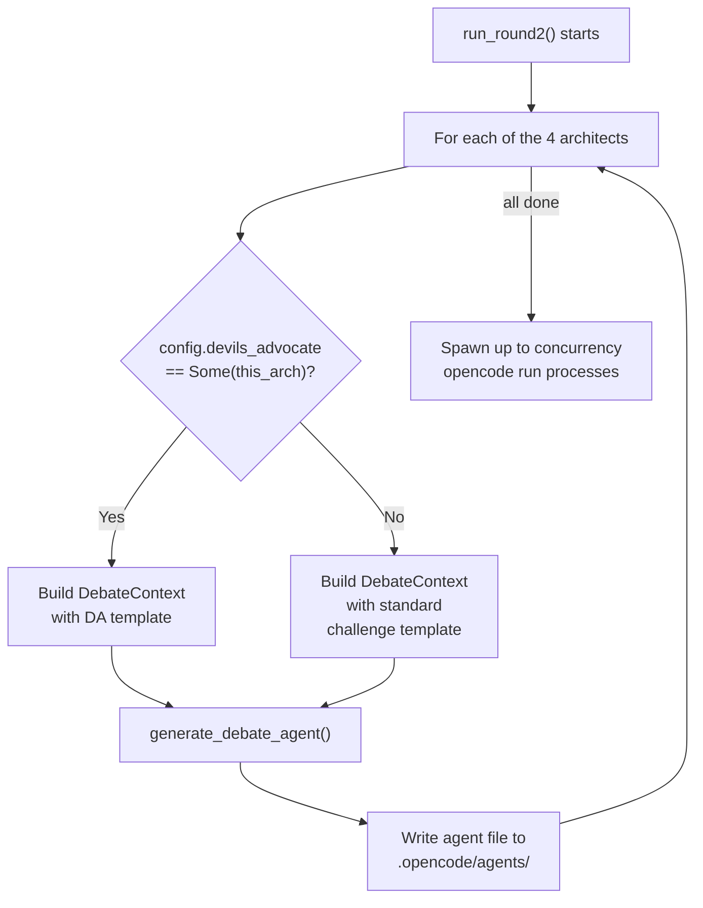
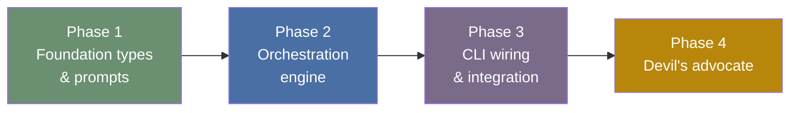

# Implementation Plan: Multi-Round Architect Debate

## Strategy

Build a debate orchestrator in 4 phases (bottom-up), each producing a working commit on a feature branch. New modules (`debate_agent.rs`, `debate.rs`) keep existing code untouched. The `opencode run --agent <name> "<prompt>"` CLI is used for headless execution — opencode v1.14+ supports non-interactive batch mode via the `run` subcommand, which runs a prompt and exits without a TUI. Documentation is updated at each phase boundary so the README and docs stay in sync with the code.

---

## Architecture Overview



---

## Full Data Flow



---

## Phase 1 — Foundation types and prompts

**Branch:** `feat/debate-phase1`
**Goal:** All new types, moderator prompt, debate-specific agent generation. No changes to existing code paths.

### Steps

| Step | Description | Files |
|------|-------------|-------|
| 1.1 | Add `DebateRole` enum (Moderator) with `agent_name()`, `description()`, `default_model()`, `prompt()` | `src/prompts.rs` |
| 1.2 | Create moderator system prompt | `prompts/system/moderator.md` |
| 1.3 | Create Round 2 challenge instruction template | `prompts/debate/round2_challenge.md` |
| 1.4 | Create `src/debate_agent.rs` with `DebateRound`, `DebateContext`, `PeerReport`, `generate_debate_agent()`, `generate_moderator_agent()` | `src/debate_agent.rs` |
| 1.5 | Wire `mod debate_agent;` in `main.rs` (no functional change) | `src/main.rs` |
| 1.6 | Unit tests for all generation functions | `src/debate_agent.rs` (inline tests) |
| 1.7 | **Documentation:** Create `docs/debate.md` covering the debate concept, protocol, and output structure | `docs/debate.md` |

**Commit:** `feat: add debate foundation types and moderator prompt`

### Type model



`DebateRole` is intentionally separate from the existing `ArchitectType` enum. `ArchitectType` derives `clap::ValueEnum` and is exposed as a CLI argument for single-agent invocations. The moderator is never invoked standalone by the user — it exists only inside the debate pipeline — so mixing it into `ArchitectType` would pollute the user-facing help text and require special-casing in the existing code paths.

### Context injection per round



### Permission model for debate agent files

Each debate agent file uses explicit `permission` frontmatter that restricts writes to only the expected output path for that round. The codebase remains read-only throughout.

```yaml
# Round 1 agent (writes to reviews/round1/ only)
permission:
  edit:
    "*": deny
    "reviews/round1/arch-*.md": allow
  write:
    "*": deny
    "reviews/round1/arch-*.md": allow
  bash:
    "*": deny
    "git log*": allow
    "git diff*": allow
    "git status": allow
  webfetch: ask

# Round 2 agent (writes to reviews/round2/ only)
permission:
  edit:
    "*": deny
    "reviews/round2/arch-*.md": allow
  write:
    "*": deny
    "reviews/round2/arch-*.md": allow
  bash:
    "*": deny
    "git log*": allow
    "git diff*": allow
    "git status": allow
  webfetch: deny   # peer context already injected inline — no fetch needed

# Moderator (writes final-report.md only)
permission:
  edit:
    "*": deny
    "reviews/final-report.md": allow
  write:
    "*": deny
    "reviews/final-report.md": allow
  bash:
    "*": deny
  webfetch: deny
```

`webfetch` is `ask` in Round 1 (agents may want to look up library docs) and `deny` in Round 2 and synthesis (all context is already injected inline — external fetches would be noise).

---

## Phase 2 — Orchestration engine

**Branch:** `feat/debate-phase2` (from `feat/debate-phase1`)
**Goal:** Spawn/wait/verify logic, concurrency control, fail-fast on missing output.

### Steps

| Step | Description | Files |
|------|-------------|-------|
| 2.1 | Add debate-specific error variants | `src/error.rs` |
| 2.2 | Create `src/debate.rs` with `DebateConfig` struct and `ProcessRunner` trait | `src/debate.rs` |
| 2.3 | Implement `ensure_round_dirs()` | `src/debate.rs` |
| 2.4 | Implement `RealRunner` — wraps `opencode run --agent <name> "<prompt>"` | `src/debate.rs` |
| 2.5 | Implement `run_round1(config, runner)` — generate, spawn, wait, verify | `src/debate.rs` |
| 2.6 | Implement `run_round2(config, runner)` — read reports, inject context, spawn, wait, verify | `src/debate.rs` |
| 2.7 | Implement `run_synthesis(config, runner)` — read all 8, generate moderator, spawn, verify | `src/debate.rs` |
| 2.8 | Implement `run_debate(config)` — full orchestration | `src/debate.rs` |
| 2.9 | Wire `mod debate;` in `main.rs` | `src/main.rs` |
| 2.10 | Unit tests with `MockRunner` | `src/debate.rs` (inline tests) |
| 2.11 | **Documentation:** Update `docs/debate.md` with orchestration internals, error handling, concurrency | `docs/debate.md` |

**Commit:** `feat: add debate orchestration engine`

### New error variants

```rust
// src/error.rs additions

#[error("debate round {round} agent {agent} failed with exit code {code}")]
DebateAgentFailed { round: u8, agent: String, code: i32 },

#[error("debate round {round} agent {agent} did not produce expected output at {path}")]
DebateOutputMissing { round: u8, agent: String, path: String },

#[error("failed to read debate report {path}: {source}")]
DebateReportRead { path: String, source: std::io::Error },

#[error("failed to create debate round directory: {0}")]
DebateRoundDirCreation(std::io::Error),

#[error("failed to spawn opencode for debate: {0}")]
DebateSpawnFailed(std::io::Error),
```

### `ProcessRunner` trait

The real subprocess interaction is hidden behind a trait so orchestration logic can be unit-tested with a `MockRunner` that writes synthetic output files instead of calling opencode.

```rust
pub trait ProcessRunner {
    fn run_agent(&self, agent_name: &str, prompt: &str) -> Result<(), AppError>;
}

pub struct RealRunner;   // production: calls `opencode run --agent <name> "<prompt>"`
pub struct MockRunner {  // tests: writes expected output files to disk
    pub base_dir: PathBuf,
}
```

### Concurrency control



Output file existence is checked **in addition to** exit code because `opencode run` may exit 0 even when the LLM declines to produce output. The file check is the authoritative signal.

### Module structure



---

## Phase 3 — CLI wiring and integration

**Branch:** `feat/debate-phase3` (from `feat/debate-phase2`)
**Goal:** Expose debate pipeline through CLI flags, add integration smoke test.

### Steps

| Step | Description | Files |
|------|-------------|-------|
| 3.1 | Add `--debate` and `--concurrency` flags to `Cli` struct | `src/cli.rs` |
| 3.2 | Relax `architect` positional arg: `required_unless_present_any` includes `"debate"` | `src/cli.rs` |
| 3.3 | Wire debate path in `main.rs` | `src/main.rs` |
| 3.4 | Pass `cli.model` through to `DebateConfig` | `src/main.rs` |
| 3.5 | CLI unit tests — flag parsing, conflict rules | `src/cli.rs` |
| 3.6 | Integration smoke test (`#[ignore]`, requires opencode in PATH) | `tests/integration.rs` |
| 3.7 | **Documentation:** Update `README.md` — add debate section, usage examples, updated permission modes table | `README.md` |
| 3.8 | **Documentation:** Update `docs/debate.md` — add CLI reference, examples, troubleshooting | `docs/debate.md` |

**Commit:** `feat: wire debate mode to CLI`

### Updated CLI flow



### New CLI flags

```
architecture_prompts --debate [OPTIONS]

OPTIONS:
    --debate
                 Run multi-round architect debate (all four personas + moderator).
                 Incompatible with: --full, --review, --clean, --dry-run.

    --concurrency <N>
                 Maximum number of concurrent opencode processes during debate.
                 Default: 4. Reduce if hitting provider rate limits.
                 Only valid with --debate.

    -m, --model <PROVIDER/MODEL>
                 Override the LLM model for all debate agents.
                 If omitted, each persona uses its built-in default.
```

### Flag conflict matrix

| Flag | Conflicts with |
|------|---------------|
| `--debate` | `--full`, `--review`, `--clean`, `--dry-run` |
| `--concurrency` | requires `--debate` |
| `--debate` | `<ARCHITECT>` positional arg (debate runs all four) |

### Integration smoke test

The smoke test is gated with `#[ignore]` so it does not run during `cargo test`. Run it explicitly:

```bash
cargo test --test integration debate_smoke -- --ignored
```

The test:
1. Sets up a temporary directory with a minimal Rust project
2. Runs `architecture_prompts --debate --concurrency 1`
3. Asserts `reviews/final-report.md` exists and is non-empty
4. Asserts `reviews/round1/` and `reviews/round2/` each contain 4 files

---

## Phase 4 — Devil's advocate pattern

**Branch:** `feat/debate-phase4` (from `feat/debate-phase3`)
**Goal:** One designated agent gets a modified Round 2 prompt that forces adversarial challenges regardless of agreement, preventing groupthink.

### Steps

| Step | Description | Files |
|------|-------------|-------|
| 4.1 | Create devil's advocate prompt template | `prompts/debate/devils_advocate.md` |
| 4.2 | Add `devils_advocate: Option<ArchitectType>` field to `DebateConfig` | `src/debate.rs` |
| 4.3 | Add `--devils-advocate <ARCHITECT>` CLI flag (requires `--debate`) | `src/cli.rs` |
| 4.4 | Modify `run_round2()` to use DA template for the designated agent | `src/debate.rs` |
| 4.5 | Unit tests — DA agent gets DA prompt, others get standard challenge prompt | `src/debate.rs` |
| 4.6 | CLI tests — flag parsing | `src/cli.rs` |
| 4.7 | **Documentation:** Add devil's advocate section to `docs/debate.md` and `README.md` | `docs/debate.md`, `README.md` |

**Commit:** `feat: add devil's advocate pattern for debate round 2`

### Devil's advocate Round 2 flow



### Devil's advocate prompt intent

The template in `prompts/debate/devils_advocate.md` instructs the designated agent to:

- Challenge the **strongest and most agreed-upon** claims from the other three agents — not just the weak ones
- Explicitly not endorse anything, even claims it privately agrees with
- Look for unstated assumptions, missing edge cases, and unexamined trade-offs in every finding
- Treat apparent consensus as a signal to probe harder, not as a reason to agree

This is distinct from the standard Round 2 challenge template, which asks agents to challenge claims they *disagree* with and endorse claims they agree with. The DA agent challenges everything, breaking premature consensus.

The moderator's synthesis prompt already instructs it to weight contested findings carefully and attribute DA challenges clearly, so the final report distinguishes genuine disagreement from adversarial challenge.

### CLI usage

```bash
# Debate with complexity as devil's advocate (default when --debate is used)
architecture_prompts --debate --devils-advocate complexity

# Debate with security as devil's advocate
architecture_prompts --debate --devils-advocate security

# Debate without devil's advocate (all four use standard challenge prompt)
architecture_prompts --debate
```

`--devils-advocate` is **opt-in** — if not supplied, all four agents use the standard Round 2 challenge prompt.

---

## Documentation deliverables

| Document | Action | Phase | Content added |
|----------|--------|-------|--------------|
| `docs/debate.md` | Create | 1 | Concept, protocol, output structure, diagrams |
| `docs/debate.md` | Update | 2 | Orchestration internals, error handling, concurrency |
| `docs/debate.md` | Update | 3 | CLI reference, usage examples, troubleshooting |
| `docs/debate.md` | Update | 4 | Devil's advocate section |
| `README.md` | Update | 3 | "Debate mode" section in command reference, usage examples, updated permission modes table |
| `README.md` | Update | 4 | Devil's advocate mention in debate section |

---

## Final file tree (after all phases)

```
src/
├── agent.rs             (unchanged)
├── cli.rs               (+ --debate, --concurrency, --devils-advocate)
├── debate.rs            (NEW — orchestration engine)
├── debate_agent.rs      (NEW — debate-specific agent file generation)
├── error.rs             (+ 5 debate error variants)
├── launcher.rs          (unchanged)
├── main.rs              (+ mod debate, mod debate_agent, debate branch)
└── prompts.rs           (+ DebateRole enum)

prompts/
├── system/
│   ├── principal.md     (unchanged)
│   ├── design.md        (unchanged)
│   ├── complexity.md    (unchanged)
│   ├── security.md      (unchanged)
│   └── moderator.md     (NEW)
└── debate/
    ├── round2_challenge.md    (NEW)
    └── devils_advocate.md     (NEW — Phase 4)

docs/
├── debate.md                        (NEW — full debate documentation)
├── multiround_architects.md         (existing design doc, unchanged)
├── multiround_architects_plan.md    (this document)
└── ...

tests/
└── integration.rs       (+ #[ignore] debate smoke test)
```

---

## Risks and mitigations

| Risk | Impact | Mitigation |
|------|--------|-----------|
| `opencode run` does not write to the path specified in the prompt | Debate fails silently | Verify output file existence after each round, not just exit code; fail fast with path in error message |
| `opencode run` exits 0 even on LLM refusal or tool permission error | Silent failure | File existence check is the authoritative signal; exit code is a secondary check |
| Token budget for moderator (~40k input tokens across 8 reports) | Cost; possible context truncation | Acceptable for v1; document in `docs/debate.md`; future: add `## Key claims` summary header to each report |
| Provider rate limiting with 4 concurrent requests | Agents fail mid-round | `--concurrency` flag; user can reduce to 1 for sequential execution |
| Agent permission globs don't match opencode's glob syntax exactly | Agent cannot write output | Integration smoke test validates end-to-end; document exact tested glob syntax |
| Devil's advocate produces low-quality adversarial challenges | Noise in final report | Moderator prompt attributes DA findings clearly; synthesis does not treat DA challenges as consensus evidence |
| Round 2 injected context is very large (3 peer reports × ~2k tokens each) | Agent ignores injected context | Inline injection is deterministic (recommended in design doc); no dependency on agent reading behaviour |

---

## Dependency graph



Each phase is independently testable and committable. Phases 1–3 deliver the minimal viable debate pipeline. Phase 4 adds the devil's advocate enhancement.
