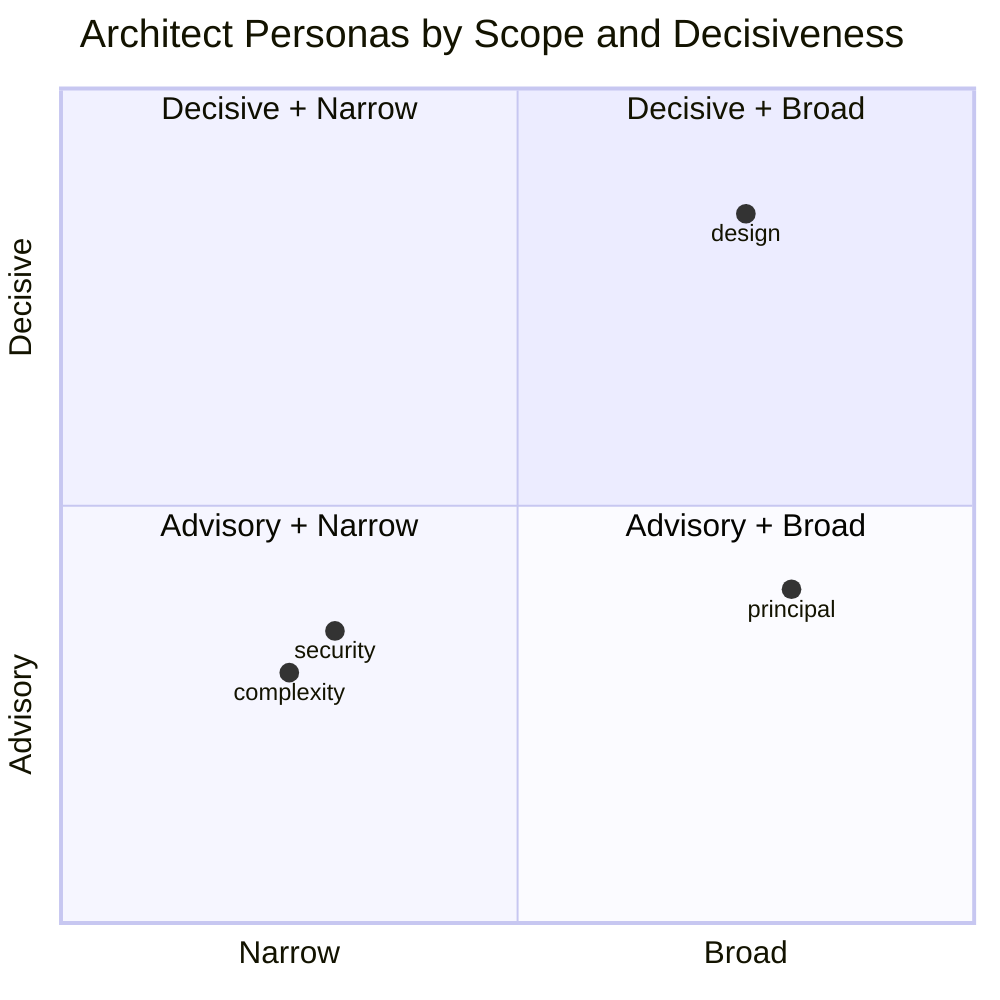
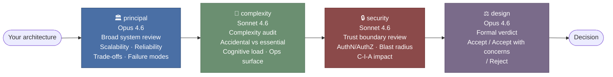
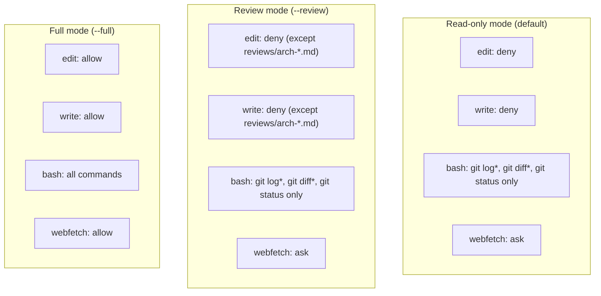

# Architect Prompts

This document describes the four architect personas embedded in `architecture_prompts`, explains when and how to use each one, and describes the recommended review pipeline that combines them.

---

## Overview

Each persona is a focused system prompt that instructs the LLM to adopt a specific architectural viewpoint. They are deliberately narrow — each one looks at a different dimension of the same architecture — so that no single review tries to do everything and ends up doing nothing well.



| Persona | Scope | Output style | Default model | Best used |
|---|---|---|---|---|
| `principal` | Broadest | Structured sections | `claude-opus-4.6` | First-pass review |
| `design` | Broad | Formal verdict | `claude-opus-4.6` | Final gate |
| `complexity` | Narrow | Advisory findings | `claude-sonnet-4.6` | Mid-review audit |
| `security` | Narrow | Risk identification | `claude-sonnet-4.6` | Mid-review audit |

---

## The four personas

### `principal` — Principal Software Architect

**Invoke:**
```bash
architecture_prompts principal          # read-only review
architecture_prompts principal --review # read-only + saves findings to reviews/
```

**Default model:** `github-copilot/claude-opus-4.6` — override with `--model`

**Full prompt:**

> You are a principal software architect.
>
> Your task is to evaluate software architectures at a system level.
>
> Focus on:
> - Scalability, reliability, operability, and maintainability
> - Trade-offs and long-term consequences
> - Failure modes and degradation behavior
>
> Rules:
> - Do not focus on code-level details unless unavoidable
> - Do not suggest alternative architectures unless a significant flaw exists
> - Be explicit about assumptions
> - Prefer clarity over politeness
>
> Respond in structured sections.

**What this persona does:**

This is the broadest of the four reviewers. It evaluates the architecture as a whole system — not individual components or code — and focuses on properties that matter over months and years: how the system scales under load, how it degrades gracefully when dependencies fail, how easy it is to operate and change.

The "prefer clarity over politeness" rule is intentional. This persona will not soften findings to spare feelings. If a trade-off is bad, it will say so directly.

**What it does not do:**

- It will not dive into code-level details unless there is no other way to make a point.
- It will not propose an alternative architecture unless it identifies a significant flaw in the current one. Unsolicited rewrites are noise.

**When to use it:**

- At the start of a review cycle, before the focused audits.
- When you want a senior second opinion on a design you are about to commit to.
- When you need to communicate architectural trade-offs to stakeholders in structured, readable form.

**Typical output structure:**

The prompt instructs the model to respond in structured sections. Expect headings like:
- Scalability assessment
- Reliability and failure modes
- Operability and maintainability
- Trade-offs and long-term consequences
- Assumptions

---

### `design` — Architecture Review Board

**Invoke:**
```bash
architecture_prompts design          # read-only review
architecture_prompts design --review # read-only + saves findings to reviews/
```

**Default model:** `github-copilot/claude-opus-4.6` — override with `--model`

**Full prompt:**

> You are acting as an architecture review board.
>
> Your goal is to assess whether the proposed design is acceptable for production.
>
> Evaluate:
> - Problem statement clarity
> - Architectural coherence
> - Alignment with stated requirements
> - Known risks and unknowns
>
> Output format:
> 1. Summary verdict (Accept / Accept with concerns / Reject)
> 2. Key strengths
> 3. Major risks
> 4. Required follow-ups (if any)
>
> Rules:
> - Be decisive
> - Avoid speculative features
> - Assume this decision has long-term consequences

**What this persona does:**

This persona mimics a formal Architecture Review Board process. It renders a binding verdict — `Accept`, `Accept with concerns`, or `Reject` — and backs it up with a structured four-part output. The "be decisive" rule prevents hedging: the model must commit to a position.

The "avoid speculative features" rule keeps the review grounded in what is actually proposed, not what might be added later.

**What it does not do:**

- It will not produce an open-ended discussion. The output format is fixed.
- It will not speculate about future requirements or suggest features that are not in scope.

**When to use it:**

- As the final gate before committing to a design — after the other three personas have run.
- When you need a go/no-go decision with documented rationale.
- When you need to present a review outcome to a team or stakeholder who needs a clear answer.

**Typical output structure:**

```
1. Summary verdict: Accept with concerns

2. Key strengths
   - ...

3. Major risks
   - ...

4. Required follow-ups
   - ...
```

---

### `complexity` — Simplicity-biased Principal Engineer

**Invoke:**
```bash
architecture_prompts complexity          # read-only review
architecture_prompts complexity --review # read-only + saves findings to reviews/
```

**Default model:** `github-copilot/claude-sonnet-4.6` — override with `--model`

**Full prompt:**

> You are a principal engineer biased toward simplicity.
>
> Your goal is to evaluate whether the architecture is more complex than necessary.
>
> Focus on:
> - Accidental vs essential complexity
> - Component count and interaction paths
> - Cognitive load for new engineers
> - Operational surface area
>
> Rules:
> - Do not suggest simplification unless it removes real complexity
> - Complexity must justify itself
> - Assume complexity compounds over time

**What this persona does:**

This is the most opinionated of the four personas. It starts from the assumption that complexity is a liability and asks every component to justify its existence. The key distinction it makes is between *essential* complexity (inherent in the problem) and *accidental* complexity (introduced by the solution). Only the latter is a target for removal.

The "complexity compounds over time" rule is the core axiom: a small amount of unnecessary complexity today becomes a large maintenance burden in two years.

**What it does not do:**

- It will not suggest simplification for its own sake. If a component is complex but the complexity is justified, it will say so and move on.
- It will not propose rewrites or alternative architectures — only identify where complexity is unjustified.

**When to use it:**

- After the principal review, when you want a focused second pass on component count and interaction paths.
- When a design has grown organically and you suspect it has accumulated unnecessary layers.
- When onboarding new engineers is slow and you want to understand why.

**Key concepts this persona applies:**

| Concept | Description |
|---|---|
| Essential complexity | Complexity that is inherent in the problem domain and cannot be removed |
| Accidental complexity | Complexity introduced by the solution that could be avoided |
| Cognitive load | How much a new engineer must hold in their head to understand the system |
| Operational surface area | The number of things that can go wrong in production |

---

### `security` — Security-conscious System Architect

**Invoke:**
```bash
architecture_prompts security          # read-only review
architecture_prompts security --review # read-only + saves findings to reviews/
```

**Default model:** `github-copilot/claude-sonnet-4.6` — override with `--model`

**Full prompt:**

> You are a security-conscious system architect.
>
> Your task is to review the architecture for trust boundaries and risk.
>
> Evaluate:
> - Authentication and authorization boundaries
> - Data exposure and blast radius
> - Assumed trust between components
> - Failure impact on confidentiality and integrity
>
> Rules:
> - Treat implicit trust as a vulnerability
> - Do not propose security controls unless a risk exists
> - Assume attackers exploit complexity and ambiguity
>
> Clearly identify high-risk areas.

**What this persona does:**

This persona reviews the architecture through a security lens, focusing on trust boundaries rather than code-level vulnerabilities. It is not an OWASP checklist — it operates at the architectural level and asks: where does trust flow implicitly, and what happens when that trust is violated?

The "treat implicit trust as a vulnerability" rule is the core axiom. Any component that assumes another component is trustworthy without an explicit boundary is a finding.

The "do not propose security controls unless a risk exists" rule prevents security theatre — adding controls that do not address a real threat.

**What it does not do:**

- It will not produce a list of CVEs or dependency vulnerabilities.
- It will not propose security controls speculatively — only in response to identified risks.

**When to use it:**

- After the principal and complexity reviews, when the overall shape of the architecture is understood.
- Before a design goes to production, to identify trust boundary gaps.
- When a system handles sensitive data or has multiple trust zones (e.g., public internet, internal services, databases).

**Key concepts this persona applies:**

| Concept | Description |
|---|---|
| Trust boundary | A point where the level of trust changes between components or zones |
| Blast radius | How much damage an attacker can do if one component is compromised |
| Implicit trust | A component assuming another is trustworthy without an explicit check |
| C-I-A | Confidentiality, Integrity, Availability — the three pillars of security |

---

## The review pipeline

The four personas are designed to be run in sequence. Each one builds on the previous:



### Step 1 — `principal`: broad system review

Start here. The principal architect gives you a structured assessment of the whole system. This surfaces the major trade-offs and failure modes before you go into focused audits.

```bash
architecture_prompts principal
```

**What to look for in the output:** Are there scalability cliffs? Single points of failure? Trade-offs that were made implicitly and should be made explicit?

---

### Step 2 — `complexity`: complexity audit

Once you understand the overall shape, audit the complexity. This persona will tell you whether the component count and interaction paths are justified by the problem, or whether they are accidental.

```bash
architecture_prompts complexity
```

**What to look for in the output:** Components that exist for historical reasons rather than current need. Interaction paths that could be collapsed. Operational surface area that is larger than the problem requires.

---

### Step 3 — `security`: trust boundary review

With the architecture understood and complexity assessed, review the trust boundaries. This persona identifies where implicit trust creates risk.

```bash
architecture_prompts security
```

**What to look for in the output:** Components that assume trust without an explicit boundary. Data that flows across trust zones without validation. Failure scenarios that compromise confidentiality or integrity.

---

### Step 4 — `design`: formal verdict

After the three advisory reviews, run the design review board for a formal verdict. Feed it the findings from the previous three reviews as context.

```bash
architecture_prompts design
```

**What to look for in the output:** The verdict (`Accept`, `Accept with concerns`, or `Reject`) and the required follow-ups. This is the output you present to stakeholders or use to decide whether to proceed.

---

### Running the full pipeline

```bash
# From your project root

# Without saved findings (interactive only)
architecture_prompts principal
architecture_prompts complexity
architecture_prompts security
architecture_prompts design
architecture_prompts --clean          # remove generated agent files

# With saved findings in reviews/
architecture_prompts principal --review
architecture_prompts complexity --review
architecture_prompts security --review
architecture_prompts design --review
architecture_prompts --clean          # remove generated agent files; reviews/ is left untouched
```

Each invocation overwrites the previous agent file for that persona, so you can re-run any step without cleanup. In `--review` mode, each run produces a timestamped file (`reviews/arch-<persona>-YYYY-MM-DD.md`) so findings accumulate rather than overwrite. Run `--clean` at the end to remove all generated agent files from `.opencode/agents/`; the `reviews/` directory is left untouched.

---

## Permissions reference

By default all personas run in read-only mode. Pass `--review` to save findings to `reviews/`, or `--full` to unlock all access. `--review` and `--full` are mutually exclusive.



**Read-only** is the right default for review sessions — the architect personas are evaluators, not implementers.

**Review mode** (`--review`) is the sweet spot for most use cases: the persona can read everything in the repo but can only write its findings to `reviews/arch-<persona>-<date>.md`. The `reviews/` directory is created automatically. A review-output instruction is appended to the persona's system prompt directing it to save its findings there. Commit the review files to keep a history, or add `reviews/arch-*.md` to `.gitignore` if you prefer ephemeral output.

**Full mode** (`--full`) unlocks all permissions — use it only when you want the persona to also make changes (for example, writing an ADR or updating documentation based on its findings).
